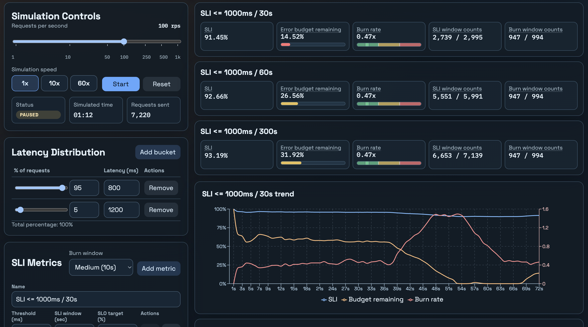

# SLI/SLO Visualizer

Interactive SLI/SLO simulator for latency-based reliability metrics.

Model request latency distribution, define sliding-window SLI metrics, and monitor:
- SLI
- Error budget remaining
- Burn rate

in real time.

## What It Does

- Simulates continuous traffic with configurable RPS.
- Samples request latency from weighted latency buckets.
- Calculates SLI using completion timestamps and sliding windows.
- Supports multiple SLI metrics with:
  - Threshold (ms)
  - SLI window (sec)
  - Burn window (sec)
  - SLO target (%)
- Computes derived values per metric:
  - Error budget remaining (numeric + status-colored bar in metric cards)
  - Burn rate
- Shows alert states for burn rate and error budget.
- Lets you reorder metrics (cards and charts follow the same order).

## Quick Start

Prerequisites:
- Node.js
- npm

Install and run:

```bash
npm install
npm run dev
```

Open:
- `http://localhost:5173`

## Screenshots

Main simulation view with simulation controls, metric cards, and latency distribution editor.


## Scripts

- `npm run dev` - start local dev server
- `npm run build` - type-check and production build
- `npm run preview` - preview production build locally
- `npm test` - run unit/component tests
- `npm run test:watch` - watch mode tests
- `npm run test:e2e` - Playwright smoke/e2e tests

## Deploy To GitHub Pages

This repo includes a GitHub Actions workflow at `.github/workflows/deploy-pages.yml`.

1. Push to `main` or `master`.
2. In GitHub, go to `Settings -> Pages`.
3. Under `Build and deployment`, set `Source` to `GitHub Actions`.
4. In GitHub, go to `Settings -> Secrets and variables -> Actions -> Variables` and add `CLARITY_PROJECT_ID` if you want Clarity enabled in production builds.
5. Wait for the `Deploy to GitHub Pages` workflow to finish.
6. Open the published URL shown in the workflow run or Pages settings.

Notes:
- The Vite `base` path is auto-detected during GitHub Actions builds, so project pages like `/sli-visualizer/` work without extra config.
- For user/org pages repos named `<user>.github.io`, the app uses `/` as base.

## Metric Semantics

SLI:
- `% of completed requests with latency <= threshold within SLI window`

Empty window behavior:
- SLI = `N/A`
- Error budget = `N/A`
- Burn rate = `N/A`

Error budget remaining:

```text
errorBudgetRemainingPct = clamp((SLI - SLO) / (100 - SLO), 0, 1) * 100
```

Burn rate (uses burn window SLI):

```text
burnRate = ((100 - burnWindowSLI) / 100) / ((100 - SLO) / 100)
```

Burn rate statuses:
- `GREEN` if `< 1`
- `YELLOW` if `1..2`
- `RED` if `> 2`
- `NA` if undefined

Error budget statuses:
- `GREEN` if `>= 50%`
- `YELLOW` if `20% .. < 50%`
- `RED` if `> 0% .. < 20%`
- `EXHAUSTED` if `<= 0%`
- `NA` if undefined

## Current Defaults

- RPS: `100`
- Speed: `1x`
- Latency buckets:
  - `95% -> 800ms`
  - `5% -> 1200ms`
- Default SLI metrics:
  - `SLI <= 1000ms / 30s`, burn window `5s`, SLO `90%`
  - `SLI <= 1000ms / 60s`, burn window `5s`, SLO `90%`
  - `SLI <= 1000ms / 300s`, burn window `5s`, SLO `90%`

## Notes

- This is a frontend-only demo app (no backend, no persistence).
- Randomness comes from weighted bucket sampling with `Math.random()`.
- Burn rate variance is expected for short burn windows; increase burn window to reduce fluctuation.
